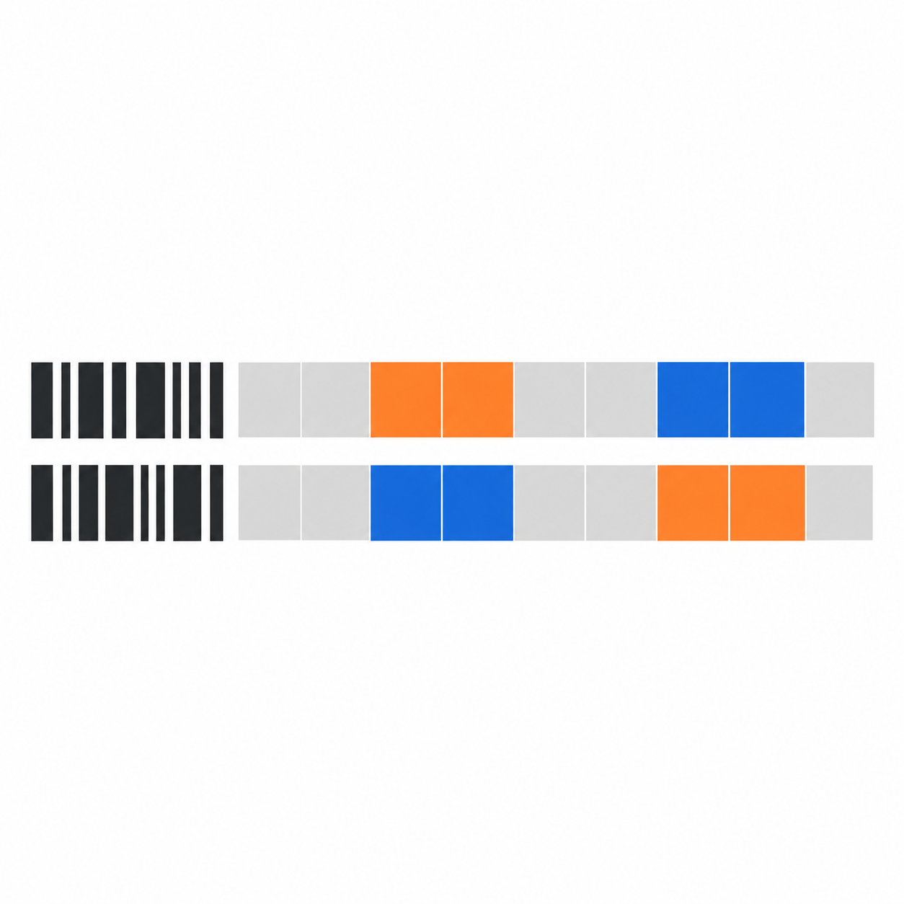

BarcodeCNV is a CNV-calling tool designed for static-barcode lineage tracing single cell RNA sequencing.
Here, static-barcode lineage tracing means transducing cells with inherited, expressed static nucleotide sequence barcodes (systems such as LARRY, CellTag, WILDseq, SPLINTR).

BarcodeCNV uses static lineage barcodes to pool sparse single-cell RNA counts, identify supported groups of genetically similar barcodes, and estimate their copy-number alterations. The aim is to support genotype-phenotype analysis while leaving weakly supported memberships unresolved. Default clone calling discovers groups from inferred CN paths and checks membership against the spread of mean CN probability profiles. Local smoothed haplotype-fraction (HF) differences can further subdivide these groups. Self-centred, InferCNV-style smoothed expression supports phase pooling and diagnostics; the original expression-first grouping remains available as an explicit method. An external normal expression reference, supplied directly or fitted as a mixture of available normal profiles, supports CN calling. A default 5% CN-independent depth-outlier component limits the influence of individual genes inconsistent with that reference. A dual-signal hidden Markov model (HMM) combines unsmoothed expression counts and phased allele counts to report uncertain CN states for each barcode and for directly pooled cells within each final group. A permutation diagnostic separately tests for barcode-associated regional signal.

# Quick Start

Choose one installation route below; no manual repository clone is needed.
These instructions support **Linux x86_64** and start from **hg38 Cell Ranger
outputs**, using the B-cell normal expression panel by default. Supply a
`cells.tsv` file with `cell` and `barcode` columns mapping cell IDs to lineage
barcodes. Each run treats the selected cells as one cohort from one donor.

## Conda / Mamba

```sh
conda create -n barcodecnv --override-channels --strict-channel-priority \
  -c https://jdm204.github.io/BarcodeCNV/channel \
  -c conda-forge -c bioconda barcodecnv
conda activate barcodecnv
barcodecnv setup --tools path --genome hg38
barcodecnv run --outs /path/to/cellranger/outs \
  --cells cells.tsv --out results
```

For Mamba, replace `conda` with `mamba` in the create and activate commands.
This installs the Python package, cellSNP-lite, bcftools and Java together;
`setup --tools path` uses those tools and downloads Beagle and the reference data.

## Pixi

```sh
pixi global install \
  -c https://jdm204.github.io/BarcodeCNV/channel \
  -c conda-forge -c bioconda barcodecnv
barcodecnv setup --tools path --genome hg38
barcodecnv run --outs /path/to/cellranger/outs \
  --cells cells.tsv --out results
```

Pixi installs the same conda package and exposes `barcodecnv` without requiring
environment activation. See [CONDA.md](docs/CONDA.md) for version pinning and
channel details.

## uv

With uv and Git installed, install the current Python source directly from GitHub:

```sh
uv tool install --python 3.13 \
  "git+https://github.com/jdm204/BarcodeCNV.git"
barcodecnv setup --genome hg38
barcodecnv run --outs /path/to/cellranger/outs \
  --cells cells.tsv --out results
```

uv manages an isolated Python environment. Here, `setup` also installs
cellSNP-lite, bcftools and Java in a private environment. If uv reports that its
executable directory is missing from `PATH`, run `uv tool update-shell` and open
a new shell before running `barcodecnv`.

For all three routes, setup is a one-time shared download: allow approximately
32.4 GB of transfers plus tools and smaller resources, and 15–20 GB free disk
space. See [RESOURCES.md](docs/RESOURCES.md) for cache locations and retries, and
[PREPROCESSING.md](docs/PREPROCESSING.md) for input requirements and reference
overrides. Final tables and plots are written to `results/inference/`.

# Usage

Cell Ranger preprocessing uses cellSNP-lite and Beagle; normal expression reference fitting is included in Python.

The methods document [pbpc.typ](docs/pbpc.typ) describes the current algorithm and
uncertainty summaries. From this directory, build it with
`typst compile docs/pbpc.typ docs/pbpc.pdf`; its figures are bundled in `docs/figures/`.

## Command line

The examples below use a source checkout: from this directory, `uv sync --locked`
installs the pinned development environment. If you installed through any Quick
Start route above, replace `uv run barcodecnv` with `barcodecnv`; for conda/mamba
or pixi, retain `--tools path` when running setup.

For hg38 B-cell data, first fetch the resources and native tools, then run:

```sh
uv run barcodecnv setup --genome hg38
uv run barcodecnv run --outs /path/to/cellranger/outs \
  --cells cells.tsv --out results
```

This prints stages to the console, preprocesses the BAM/counts and then runs
inference, fitting the downloaded B-cell expression panel by default. Automatic
native-tool installation currently supports Linux x86_64. The hg38 phasing
resources are a substantial one-time download; see [RESOURCES.md](docs/RESOURCES.md)
for cache locations, disk requirements, retries and existing-tool overrides.
[PREPROCESSING.md](docs/PREPROCESSING.md) describes inputs and processing. The reusable bundle is
`results/preprocessing/prepared.h5`; final tables and plots are under
`results/inference/`. `results/pipeline.json` records overall completion or the
failed stage. Existing output directories are never overwritten. The prepared
bundle is retained if inference fails.

To run the stages separately:

```sh
uv run barcodecnv preprocess --outs /path/to/cellranger/outs \
  --cells cells.tsv --reference reference.tsv --out prepared_sample
uv run barcodecnv infer prepared_sample/prepared.h5 --out results
```

A pre-fitted `--reference` can be replaced by `--reference-panel /path/to/panel`.
The Python tool then fits the normal expression mixture and
saves the profile, weights and gene-selection audit. `fit-reference` exposes that
step on its own. See [REFERENCE_FITTING.md](docs/REFERENCE_FITTING.md) for panel format,
settings, the optional regional method and limitations.

If count tables and phased alleles are already available, `infer` can load them directly:

```sh
uv run barcodecnv infer \
  --matrix filtered_feature_bc_matrix/ \
  --cells cells.tsv --genes genes.gtf.gz \
  --reference reference.tsv --alleles phased_counts.tsv.gz \
  --genetic-map genetic_maps/ --out results
```

Here the starting data are a 10x count matrix and annotation/phased-allele tables;
FASTQ alignment remains upstream;
BAM pileups/phasing are handled by `preprocess` or end-to-end `run`.
Allele counts are optional for expression-only analyses. Omit `--genetic-map`
when the allele table already includes per-locus genetic positions.

The command saves `results/prepared.h5`, the exact input bundle used, and records
its SHA-256 and original source paths in `run.json`. This snapshot is retained
if subsequent inference fails and can be reused without loading the source
tables again:

```sh
uv run barcodecnv infer results/prepared.h5 --out rerun
uv run barcodecnv signal results/prepared.h5 --out signal --permutations 199
```

`prepare` remains available for creating a reusable bundle separately. `signal`
also accepts `--matrix`, `--cells`, `--genes` and the optional loader arguments
directly; it does not require an external reference or fit HMMs. Choose either
a positional prepared bundle or count-input options; combining them is rejected.

Use `--help` on any command. `infer` and `run` default to 64 whole-cell bootstraps, 256
independent CN paths and 199 signal permutations. `--skip-signal` and
`--no-cn-refinement` omit those stages explicitly. Rolling haplotype-fraction
refinement is enabled by default; `--no-hf-refinement` reports the selected
clone method's groups directly. Use both refinement switches for expression-only
reporting groups. `--phase-iterations` changes
the fitting iteration limit; unconverged fits cannot report a completed result.
Output directories/files must be new. Failed inference runs retain `run.json` with their
failure status and any already completed diagnostic outputs.

Choose clone calling with `clone_method` in `api.infer()` or `api.run_pipeline()`,
or `--clone-method` in `infer` or `run`:

| Method | Behaviour |
|---|---|
| `mean_profile` (default) | Discover CN groups below unsupported tree branches; assess membership against the 95th percentile of reference-member distances calculated from mean CN probability profiles. |
| `mean_distance` | Same discovery and relative membership; stricter rejection against average within-reference distance. |
| `draw_quantile` | Same discovery; calculate the reference-member 95th percentile separately on each posterior draw. |
| `expression` | Original expression-first groups, subdivided by supported CN contrasts. |
| `self_expression` | Existing self-centred expression recursive splitters, with no CN refinement. |
| `self_expression_tree` | Self-centred expression distance tree with whole-cell bootstrap uncertainty and reference-member compatibility. |
| `self_expression_hf` | Same tree method using self-centred expression jointly with phase-aligned HF, balanced by bootstrap noise. |
| `self_expression_correlation` | Experimental shape-distance tree with a bootstrap excess-variation check before discovery. Discards overall amplitude. |
| `self_expression_hf_debiased` | Experimental joint expression/HF tree correcting measurement-noise inflation, with the same excess-variation check. |

```python
result = api.infer(prepared, clone_method="mean_profile")
result.clone_membership_table()  # Pre-HF membership decisions and reference indices.
```

```sh
uv run barcodecnv infer prepared.h5 --out results --clone-method mean_profile
```

The first three methods group **CN profiles**. The `self_expression*` methods
instead group self-centred smoothed expression, optionally jointly with HF;
their decisions do not consume external-reference expression or fitted CN
calls. The joint method retains the existing fitted phase alignment. All methods use
the same barcode CN fit; optional HF refinement follows clone calling.
`--no-cn-refinement` bypasses the selected method and uses expression groups.
`result.clone_calls` contains the method, pre-HF groups, discovery/anchor groups,
relative membership support and decision audits. Group IDs may have gaps;
zero denotes unresolved membership. HF can subsequently split groups or leave
additional barcodes unresolved. For evaluation of the self-centred methods,
set `hf_refinement=False` to omit that subsequent refinement. The joint method
still uses HF as an input to its initial grouping. If no allele counts are
available it falls back to expression and records that in
`result.clone_calls.feature_info`. Expression and HF use matching whole-cell
bootstrap resamples; each modality is scaled to equal total bootstrap-noise
energy. The correlation and measurement-noise-corrected variants retain one
undivided group when the bootstrap detects no excess variation; membership
support is then undefined.
This is not evidence that all barcodes have the same clone. Noise correction can
absorb weak private events, and correlation can hide dosage differences.

Choose a grouping method with your reference's study, assay and cell-state
coverage in mind. The default CN-based method is a reasonable starting point
with a well-matched reference. Reference mismatch can distort its CN profiles
and cause both false splits and false merges. Self-centred methods can preserve
clone information under that mismatch, but may mistake expression programmes
for CNA differences or merge clones with weak differences. Inspect smoothed
expression and HF together when assessing a proposed split: similar expression
alone does not rule out a difference in allelic balance.

Self centering removes external expression-reference mismatch from the
expression grouping inputs and cannot detect alterations shared across the
cohort. Input gene selection and fitted HF phase remain conditioning assumptions.
It does not repair absolute CN calls: CN reports still use an external reference
even when groups are called from self-centred data. Agreement between methods
indicates stability to that choice, not a calibrated probability of correctness;
methods can share false merges.

The default needs at least three reference-member scores to estimate a local
spread. Smaller groups borrow within-group scores from other anchored groups;
if none are available, membership remains unresolved. In particular, a dataset
containing only two barcodes cannot establish this compatibility baseline.
These empirical thresholds are not calibrated clone probabilities. The default
can absorb smaller private CNAs into an existing group rather than leaving them
unresolved.

Poisson–lognormal depth and joint barcode CN/phase inference are the defaults.
The two options can be varied independently; to reproduce the earlier NB and
shared conditional-phase workflow:

```sh
uv run barcodecnv infer sample.h5 --out nb_conditional \
  --depth-family nb --barcode-phase conditional --depth-outlier-probability 0
```

The depth likelihood includes a **5% CN-independent outlier mixture** by default.
This gives genes with large reference discrepancies an alternative explanation
without requiring a CN change. It is a prior mixture probability for each gene
observation, not a quota of discarded genes or a false-call probability. Allele
likelihoods, phase transitions and the CN transition prior are unchanged.

Use `--depth-outlier-probability P` to adjust it (`0 <= P < 1`). Consider lowering
it, for example to `0.01`, when you have evidence that your reference is well
matched; `0` disables the mixture. A larger value can also weaken genuine depth
signals, so increasing it is not an unconditional improvement.

```sh
uv run barcodecnv infer sample.h5 --out matched_reference \
  --depth-outlier-probability 0.01
```

The same setting is used during pooled phase/noise fitting, barcode inference
and group pseudobulk fitting. Inlier dispersion is refitted at each aggregation
level. The broad outlier component is a Poisson–lognormal distribution centered
at the diploid reference rate, with natural-log standard deviation 3, identical
across all CN states. It remains PLN when the inlier family is NB. This is a
contamination-mixture extension of the existing depth emission, not spatial
binning or likelihood tempering. `run.json` and HDF5 attributes record the
outlier probability and scale.

`pln` adapts Poisson–lognormal count likelihood. Its reference
rate is the **latent median**; NB uses the arithmetic mean. For PLN,
`sigma = sqrt(log1p(alpha))`; `alpha` remains the existing noise-search coordinate.
SciPy supplies mode location and adaptive QUADPACK quadrature. 
Numba compiles the integrand to a C callback; quadrature convergence
checks remain with SciPy. No approximate depth distribution is substituted.

`joint` sums and samples complete CN/phase paths in a 20-state HMM separately
for each barcode and fits dispersion using that joint likelihood. It avoids
the expected-log approximation but removes cross-barcode phase sharing for CN
calling. The pooled phase fit still aligns the rolling-HF grouping features.
`phase` in the output remains that common alignment; `barcode_phase` records
the separate joint marginals. With a symmetric phase prior, absolute haplotype
orientation can remain unidentified even when CN is well resolved. Probability
statements are still conditional on fitted noise and reference parameters.

### Input tables

CSV, TSV and gzip-compressed tables are accepted. IDs are strings, including
numeric-looking barcodes. Physical coordinates are one-based.

* **Expression:** 10x Matrix Market directory (`matrix.mtx`, `features.tsv`,
  `barcodes.tsv`, optionally gzipped), or a 10x HDF5 matrix. Only Gene Expression
  features enter RNA library totals. Whole-assay library sizes are computed
  before selecting annotated/reference-matched genes.
* **Cells:** `cell`, `barcode`. The existing `cell_barcode` and
  `lineage_barcode` aliases are accepted. All selected cells form one cohort.
* **Genes:** GTF/GTF.gz, or `gene`, `chromosome`, `position` (alternatively
  `start`, `end`; their integer midpoint is used). Version suffixes are removed
  from gene IDs; ambiguous duplicates are rejected. Genes are sorted genomically.
* **Reference:** `gene`, `fraction`, for fractions relative to the whole assay;
  alternatively `gene`, `expression`, normalized over the entire supplied
  reference profile before gene selection. This must be a diploid reference
  suitable for the assay. It is not inferred from the cohort-median plotting
  reference. Omit it when preparing input solely for `signal`.
* **Alleles:** `cell`, `chromosome`, `position`, `h1`, `h2`, optionally `het`
  (default 1) and `phase_prob` (default 0.99, an explicit convention rather than
  a measured phase quality). Numbat `cell/CHROM/POS/AD/DP/GT/cM` is also accepted;
  `GT` must be phased `0|1` or `1|0`. Omit allele counts for expression-only data.
* **Genetic positions:** a PLINK four-column `.map` file or directory of maps. 
  Without a map, allele tables must contain consistent per-locus `genetic_cm` (or `cM`) values.

Only annotated cells are retained. Reference-supported annotated genes present
in the assay are used; the loader performs no CN-based gene selection. The
barcode/SNP count records are retained independently of gene count records.
The prepared `cell-counts-v2` bundle stores sparse CSC matrices (feature × cell),
explicit cell/gene/SNP labels, original library sizes and zero-based grid indices.
`CellBundle`, `read_bundle` and `write_bundle` in `barcodecnv.bundle` provide the
same boundary for programmatic loading. Existing v1 bundles remain readable;
additional legacy cell metadata is ignored.

### Outputs

* `prepared.h5`: reusable input snapshot when starting from count files.
  Bundle-input runs use the supplied file directly.
* `summary.png`: vertically stacked self-relative expression, external-reference
  expression, rolling haplotype fraction (when available), and CN calls.
  All panels use the same barcode/genomic order with called
  group boundaries. CN saturation represents conditional state probability;
  the separate strip shows the selected clone method's membership support (or expression split
  stability for `expression`), combined with HF stability by taking the minimum.
  Unresolved or unavailable values are grey; this is not a clone probability.
  Haplotype fractions are signed and centered across barcodes. Missing expression or HF coverage is
  white. No ground truth is used in this figure.
* `signal.png`, `signal.json`, `signal_null.csv`: observed regional count
  statistic, permutation histogram and Monte Carlo p-value, or an explicit
  `unassessable` result if fewer than two lineage barcodes are present.
* `groups.csv`, `order.csv`, `weighted_nodes.csv`, `core_nodes.csv`,
  `cn_nodes.csv`, `hf_nodes.csv`: reporting groups, ordering and decision audits. Group zero
  denotes unresolved membership. `phase_group` is a separate pooling decision.
  `pre_hf_group` preserves the groups before HF refinement; `hf_stability` is
  the additional split stability (empty when HF refinement was skipped).
  `clone_membership_support` is relative group preference or recursive split support, empty when unavailable.
* `clone_membership.csv`: pre-HF membership decisions for the CN-based methods,
  including rejection reasons and calibration references. Reference indices
  refer to the barcode order in `groups.csv`. `result.h5` also stores the method,
  pre-HF calls, discovery groups, anchors and support under `clone_calling`;
  `run.json` records the selected method and whether clone calling ran.
* `barcode_cn_genes.csv.gz`: barcode/group IDs, gene coordinates, marginal MAP
  class and the four class probabilities. Includes unresolved barcodes.
* `group_cn_genes.csv.gz`: one row per resolved group and gene, with group size,
  `consensus_*` cell-weighted barcode probabilities, `pooled_*` group-pseudobulk
  posterior probabilities, and uncertain/conflicting member cell fractions.
* `group_cn_segments.csv.gz`: contiguous runs of pooled marginal MAP classes on
  the full gene/SNP grid, split at chromosome boundaries. Bounds are the first
  and last observed marker, not precise breakpoint estimates. Mean/minimum
  state probabilities summarize marker marginals, not whole-segment probability.
* `group_cn.png`: consensus, pseudobulk calls, uncertain member fractions and
  confident conflicts with pseudobulk calls in separate vertically stacked panels.
* `result.h5`: conditional probabilities (**barcode × marker × class**),
  labelled fine genomic grid, gene indices, shared phase probabilities,
  expression matrices (**gene × barcode**) and broad CN distance draws.
  `haplotype_features/` contains centered signed fractions and effective allele
  coverage (**region × barcode**), region centers and smoothing parameters.
  `group_calls/` stores group labels, sizes, consensus/pooled probabilities
  (**group × marker × class**), group phase and member-disagreement summaries.
  All groups and chromosomes follow the explicit stored labels. The gene tables
  are convenient subsets; the HDF5 retains SNP-only positions as well.
* `run.json`: parameters, numerical convergence, runtime and completion status.

The association diagnostic tests whether barcode labels explain regional count
structure across the selected cells. Expression confounding can contribute;
it does not establish CN causation or general data quality. A nonsignificant
result does not prove the absence of useful barcode information. The statistic
and centring are fixed without barcode labels; permutations preserve barcode
cell counts across the cohort. Only the joint depth+allele statistic receives
the formal permutation p-value.

## Python workflows

Start with `from barcodecnv import api`. Notebook completion on `api.` lists the
supported workflow functions and types. Functions return Python objects; their
attributes and methods are available through completion and `help()`.

### Which operations contain which?

`run_pipeline()` is the top-level **analysis** wrapper. Resource installation is
an explicit, separate operation; analysis never implicitly downloads resources.

```text
setup() → Resources                 # once, or load_resources(config_path)
from_anndata() / from_10x() → ExpressionInput

run_pipeline(expression, bam=..., config=resources)
├── preprocess() → PreparedResult
│   └── fit_reference()             # if a panel is supplied; a fitted reference is reused
└── infer() → InferenceResult
    └── signal() → SignalResult     # included unless skip_signal=True

prepare() → PreparedResult          # alternative to preprocess() for existing allele tables
```

`fit_reference()` and `signal()` can also be called separately to inspect those
stages. Calling `signal()` separately does not disable the diagnostic inside
`infer()`; normally inspect `result.signal` after inference instead.
The Python entry point is `api.run_pipeline`; the CLI command is `barcodecnv run`.

### Recommended notebook route

Adapt AnnData once, then pass the returned objects between stages. The following
assumes `adata`, a `barcode_table` with `cell` and `barcode` columns, and an indexed
BAM with `CB`/`UB` tags. The provisioned default panel is for B-cell samples;
choose a suitable normal panel for other samples.

```python
from barcodecnv import api

resources = api.setup(genome="hg38")
# On subsequent sessions, without downloading:
# resources = api.load_resources("/path/to/config.json")

expression = api.from_anndata(
    adata,
    cells=barcode_table,
    layer="counts",  # Unnormalized UMI counts.
    gene_id_key="gene_ids",  # Omit if var_names already contain gene IDs.
    library_size_key="total_counts",  # Whole-assay totals before gene filtering.
)

# Resource paths are directly usable. For inspection, resources.load_genes()
# and resources.load_reference_panel() return a DataFrame and ReferencePanel.
reference = api.fit_reference(
    expression,
    genes=resources.genes,
    reference_panel=resources.reference_panel,
)
print(reference.weights)

prepared = api.preprocess(
    expression,
    bam="/path/to/sample.bam",
    reference=reference,
    config=resources,
)
result = api.infer(prepared, bootstraps=64, seed=42)

result.groups_table()  # Labelled barcode membership and stability.
result.group_cn_table()  # Gene-level pooled CN, consensus and conflicts.
result.plot_summary()  # Open Matplotlib Figure.
```

The combined analysis call, allowing preprocessing to fit the configured panel,
is `api.run_pipeline(expression, bam="/path/to/sample.bam", config=resources)`.
For 10x input, construct `expression` using
`api.from_10x(matrix_path, cells=barcode_table)`.

If phased allele counts are already available, use the alternative preparation
route. It returns the same type and retains any fitted reference:

```python
prepared = api.prepare(
    expression,
    genes=resources.genes,
    reference=reference,
    alleles=allele_table,  # DataFrame or count-table path.
)
# Alleles must supply genetic_cm; otherwise also pass genetic_map=resources.genetic_map.
result = api.infer(prepared)
```

`reference` accepts a `FittedReference`, a gene-to-fraction mapping or a profile
file. `reference_panel` requests a new fit and is mutually exclusive with
`reference`. Gene annotations accept DataFrames with `gene`, `chromosome` and
`position` (or `start`/`end`) columns, or GTF/CSV/TSV paths.

File and AnnData convenience arguments remain available: `fit_reference` and
`prepare` accept `adata=...` or `matrix=...`; `preprocess` and `run_pipeline` accept
`adata=...` plus `bam`, or Cell Ranger `outs`. These adapt to the same object
workflow. The object route above avoids repeating count-selection arguments.

### Results and output directories

Every analysis stage's `out` is an optional **new directory**. Omit it to retain
results in memory; use the result's `.save(out)` method to export later.

| Operation | Return type | Main attributes and methods |
| --- | --- | --- |
| `from_anndata`, `from_10x` | `ExpressionInput` | `counts`, `genes`, `cells`, `libraries`, `cell_table()` |
| `setup`, `load_resources` | `Resources` | `genes`, `reference_panel`, `config_path`, `load_genes()`, `load_reference_panel()` |
| `fit_reference` | `FittedReference` | `profile`, `weights`, `audit`, `save()` |
| `prepare`, `preprocess` | `PreparedResult` | `bundle`, `reference_fit`, `provenance`, `save()` |
| `signal` | `SignalResult` | `pvalue`, `scores.joint`, `null_table()`, `plot()`, `save()` |
| `infer`, `run_pipeline` | `InferenceResult` | `prepared`, `reference_fit`, `signal`, tables, plots, `save()` |

```python
reference.save("results/reference")
prepared.save("results/prepared")
result.save("results/inference")
```

Passing `out` to an individual stage exports immediately. `preprocess(out=...)`
also retains native-tool working files and logs; without `out`, those files are
temporary and cleaned up on success or failure. A later `prepared.save()` exports
counts and provenance, without recreating native intermediates or logs.
`run_pipeline(out=...)` creates `preprocessing/`, `inference/` and `pipeline.json`
beneath that directory. Its result's `.save()` exports the inference report,
including prepared counts and retained audits, rather than recreating that
working directory layout.

Use different stage subdirectories under a common parent: existing output paths
are refused. Resource setup is the exception: it provisions a reusable disk cache.
The CLI requires output directories too. For example, `prepare --out prepared`
writes `prepared/prepared.h5`, `prepared/preprocessing.json` and, when fitted,
`prepared/reference_fit/`.

Both preparation routes preserve the fit in `prepared.reference_fit`, or `None`
when a supplied profile has no mixture-fit audit. Inference retains that object
at `result.prepared` and the fit at `result.reference_fit`. Pass the whole prepared
result to inference: passing only `.bundle`, or reloading the bare `prepared.h5`,
discards preparation context. No sidecar files are silently reloaded.

For BAM preprocessing, paths inside `.provenance` describe the original execution;
`provenance["workspace"]["retained"]` records whether its native files were kept.
The historical paths remain valid provenance after temporary files are removed.
Functions raise exceptions and leave logging configuration to the caller.

### Inspecting biological results

Tables are built from stored results and require no files or refitting. Optional
barcode/group selectors use their actual IDs, not array positions; unknown IDs
raise an error. Large tables can be restricted to a single barcode or group.

```python
membership = result.groups_table()
barcode = membership.barcode.iloc[0]
barcode_cn = result.barcode_cn_table(barcode=barcode)
group_cn = result.group_cn_table()  # Or group=<a resolved group ID>.
segments = result.group_segments_table()  # Runs of marginal pooled MAP calls.

# Raw arrays remain available, with explicit matching labels:
probabilities = result.probabilities  # barcode × marker × CN class.
barcode_ids = membership.barcode
markers = result.marker_table()
class_names = result.class_names

# Diagnostic returned by infer(), unless skip_signal=True:
result.signal.pvalue
result.signal.scores.joint
result.signal.null_table()
result.signal.plot()
```

Group CN tables distinguish cell-weighted barcode consensus from the separately
fitted pooled group model. Segment probability summaries describe their markers;
they are not probabilities that the entire segment has one state. Unresolved
barcodes remain in the barcode tables; group tables include resolved groups only.
If no groups resolve, group tables are empty with their columns preserved.

`result.plot_summary()`, `.plot_groups()` and `.plot_signal()` return open
Matplotlib Figures. `plot_signal()` raises if the diagnostic was skipped.
Figures use the caller's backend and can be customized or saved with
`fig.savefig(...)`; exporting a report leaves existing figures open. Each plot
call makes a fresh figure without rerunning inference or permutations.

Genome heatmaps concatenate the displayed chromosomes at their full GRCh38
lengths, with a shared base-pair scale and cumulative Mb coordinates. Gene-rich
chromosomes do not receive extra width. Expression colours extend between
neighbouring gene midpoints, and CN colours between neighbouring inference
markers; neither is extended beyond the first/last observed marker. Coincident
genes are averaged for display. Haplotype fractions use their original genomic
bins, with uncovered bins left blank. Grey marks areas without displayed data.
For another assembly, pass its lengths in bp as `chromosome_sizes={...}` to
`plot_summary()` or `plot_groups()`; default report exports target hg38/GRCh38.

The same table builders drive Python inspection and disk exports. `.save()`
writes tables, HDF5 results, PNG plots, the prepared counts and retained audits,
using only the stored result. Original input files need not remain available.
`result.fit` and other model internals remain available for advanced analysis;
the labelled methods above are the recommended starting point.

### AnnData count and selection contract

AnnData adapters select the intersection of `obs_names` and the cell table, in
AnnData order. Removed cells stay excluded even if they remain in the table;
unmapped observations are excluded too. 10x adapters instead require every
requested cell to be present, preserving CLI input validation. Either adapter
can omit the table for reference fitting alone; lineage labels are required for
preparation and inference. Selection information is retained in the input's
metadata and in preprocessing records.

Cell IDs must match BAM `CB` tags exactly, including suffixes. The workflow
remains single-donor. Input arrays and labels are copied, and the expression
object's count/library arrays are read-only. The original AnnData and tables
are not modified.

By default, counts come from `.X`. Select `layer="counts"` or `use_raw=True`
for `.raw.X` and its own gene axis. `.raw` must have been saved before
normalization to be suitable. Dense NumPy and SciPy sparse counts are supported.
Nonfinite, negative and fractional values are rejected; integer-valued data
alone cannot establish that these are original UMI counts.

If the chosen source contains all assayed genes, library sizes are calculated
from it. **After gene filtering, supply `library_size_key` naming an `.obs`
column of original whole-assay UMI totals**, or select a full-gene raw-count
source in `.raw`. Missing genes cannot be detected automatically. Summing only
retained genes changes the reference exposure and biases CN inference. Selecting
highly variable genes alone also removes useful genomic coverage. Gene IDs must
match the annotation and reference panel; duplicate IDs are rejected.

## Design and ownership

* `data.py`: validated, owned, read-only arrays of already prepared counts and
  reference expectations. Gene and SNP records map onto a common genomic grid;
  physical positions remain one-based, array indices are zero-based.
* `model.py`/`depth.py`: copy catalogue, count likelihoods and
  genomic/phase priors. This uses Poisson–lognormal depth by default
  and retaining NB as a comparator. For PLN the latent median is
  reference × dosage and log-scale noise is `sqrt(log1p(alpha))`. For
  NB the mean is reference × dosage and variance is `mean + alpha *
  mean**2`.
* `hmm.py`: numerical inference from supplied potentials, with no biological or
  barcode assumptions. Results own their arrays. Sampling produces independent
  conditional whole paths, not MCMC samples.
* `fitting.py`: caches emissions, fits shared phase and scalar dispersion, and
  returns explicit fitted values and diagnostics. No mutable global fit state.
* `depth_controls.py`: mixture configuration and cached CN-independent outlier
  likelihoods, shared by conditional and joint fitting.
* `joint.py`: combines CN and phase states for exact within-barcode inference,
  using the same numerical HMM engine and count likelihoods.
* `group_calls.py`: final group consensus and group-pseudobulk fits;
  `cn_reporting.py`: streaming gene tables and marginal-MAP segment exports.
* `loading.py`/`bundle.py`: file adapters and validated cell-count ownership;
  `signal.py`: label-blind features and permutation calibration;
  `bootstrap.py`/`grouping.py`: the existing PBPC2 expression decision rules;
  `haplotypes.py`: count-weighted rolling HF features and local splitting;
  `clone_calling.py`: shared CN discovery, selectable membership rules and the original expression-first refinement;
  `workflow.py`: orchestration;
  `plotting.py`/`cli.py`: presentation and filesystem output.

The count-inference entry points can also be used separately:

```python
from barcodecnv import (
    Model,
    FitOptions,
    DepthOptions,
    fit_phase_and_dispersion,
    infer_barcodes,
)

# pooled and barcodes are PreparedCounts with the same grid and SNP catalogue.
model = Model()
depth_options = DepthOptions(outlier_probability=0.05)
fit = fit_phase_and_dispersion(
    pooled, model, options=FitOptions(), depth_options=depth_options
)
posterior = infer_barcodes(
    barcodes, model, fit
)  # Inherits the pooled fit’s depth options.
paths = posterior.sample_paths(draws=256, seed=42)
```

`PreparedCounts` already contains expected diploid counts and genetic positions.
Those low-level calls do not group or pool cells. `CellBundle.prepared()` performs
explicit pseudobulking, and `barcodecnv.workflow.run_pbpc` owns the complete
inference orchestration. The smoothing port follows InferCNV 1.28.0
through step 14 and is checked against independently generated R fixtures.

## Preprocessing Cell Ranger outputs

Use [`barcodecnv preprocess`](docs/PREPROCESSING.md) to obtain a ready-to-run cell bundle
from an indexed Cell Ranger BAM, expression counts and cell-to-lineage map.
Supply a normal expression profile or a reference panel to fit.
See [PREPROCESSING.md](docs/PREPROCESSING.md) for local setup, inputs and assumptions.

## Statistical scope

The pooled CN and shared-phase fit uses structured variational updates
its product approximation is not the exact joint CN/phase posterior.
That fit supplies the common alignment used for HF features. Default barcode
CN calling instead integrates phase with a joint CN × phase HMM independently
within each barcode. The optional `conditional` route uses **expected log
likelihoods** under the pooled phase probabilities. The phase-switch process follows Numbat's
two-state continuous-time formulation.

Fitting first estimates pooled phase with heuristic dispersion, fits pooled
dispersion at fixed phase, and refits pooled phase. Default barcode inference
then fits dispersion using joint CN/phase evidence; the optional conditional
route instead holds pooled phase fixed. These are plug-in estimates; conditional
CN probabilities and paths do not integrate noise, reference or grouping
uncertainty. Nonconverged phase fits must not feed barcode inference.
Bootstrap membership stability and adaptive split statistics are heuristic
summaries, not calibrated posterior probabilities of clone identity. Reporting
group refinement does not silently change the groups used for phase fitting.

Default HF refinement follows CN refinement and only subdivides existing
groups; it cannot merge groups or recover already unresolved members. Phased
H1/H2 counts are pooled in 2 Mb base bins and smoothed over 10 Mb windows within
chromosomes. Whole-cell resampling and weak beta draws use shared base-bin
draws for overlapping windows, retaining their correlation. This conditions
on fitted MAP phase; phase uncertainty is not integrated. Cell bootstrap and
beta noise overlap as uncertainty sources, and the resulting split stability
is heuristic. No usable allele counts automatically skips this stage.

The HF audit records its parent group and the global barcode indices of that
parent; recursive `members` indices are local to the parent. Reported groups
and CN probabilities have distinct roles: changing this final refinement does
not refit barcode phase, noise or CN calls. The subsequent group reporting fit
is separate from those barcode results.

### Group CN reporting

After final grouping, descriptive consensus probabilities average barcode CN
class probabilities using cell counts as weights. These describe the inferred
composition of the group; they are not posterior probabilities of one shared
group state. A consensus MAP label is merely the class with the largest average.

For group calls, cells belonging to each final group are pseudobulked directly:
expression counts are summed per gene, H1/H2 counts per SNP, and whole-library
exposures are summed to obtain reference expectations. Distinct genes retain
separate records even if they map to the same genomic grid position. The group
pseudobulks get a new dispersion fit, followed by the joint CN/phase HMM; the
noise parameter is shared across group pseudobulks and is not copied from the
barcode fit. Gene-level count records are not multiplied across barcodes.

The model assumes one homogeneous CN/phase profile per group. Membership,
fitted group noise and reference are conditioned on, so pooled probabilities
can still be misleading if those assumptions fail. No group output feeds back
into barcode fitting or grouping. Group zero is excluded rather than pooled.
Group noise estimates, search convergence and boundary status are reported in
`run.json`, with the main fitted values also stored in the HDF5 group attributes.

At each position, `uncertain_cell_fraction` is the cell-weighted fraction of
barcodes whose maximum class probability is below 0.95. The
`consensus_conflict_cell_fraction` and `pooled_conflict_cell_fraction` instead
count cells belonging to confidently called barcodes (maximum probability at
least 0.95) whose MAP class differs from the indicated group call. These metrics
distinguish uncertain evidence from confident conflict; neither is a formal
test of group homogeneity. Cell fractions inherit each barcode's call, rather
than measuring CN states independently in each cell. Exact MAP ties use the
stored class order. Empty resolved-group results retain table headers.

The reporting API can also be used independently:

```python
from barcodecnv.group_calls import summarize_groups

group_calls = summarize_groups(
    bundle,
    model,
    posterior.classes,
    final_group_labels,
    depth_options=posterior.posterior.depth_options,
)
```

Here `posterior` is the `BarcodeFit` returned by `infer_barcodes` above. The
reporting function does not modify it. Both pseudobulk and consensus calls
should be read alongside the member-conflict summaries. An initial attempt
multiplying member barcode likelihoods was dropped after producing heavily
fragmented RBL1 calls; direct pseudobulking reduces this fragmentation.

## Development

```sh
cd barcodecnv
uv sync --locked
uv run pre-commit install
uv run ruff check .
uv run ruff format --check .
uv run pytest
```

Python 3.13 is selected by `.python-version`; `uv.lock` pins the development
environment. Runtime dependencies are NumPy, SciPy, Numba, pandas, h5py and
Matplotlib; development adds pytest, Ruff and pre-commit.

Install the Git hooks once per checkout with `uv run pre-commit install`.
Before each commit, they apply safe Ruff lint fixes and formatting to staged
files, including Python code blocks in Markdown. If files change, review and
stage the fixes, then commit again. The hooks use the Ruff version in `uv.lock`,
matching CI. To check all tracked files, run `uv run pre-commit run --all-files`.

Ruff owns formatting, import sorting and linting for the package, tests and bundled
figure scripts. Configuration lives in `pyproject.toml`, targeting
Python 3.13 with Ruff's default formatting style. To apply safe lint fixes and format:

```sh
uv run ruff check --fix .
uv run ruff format .
```

The rules cover basic correctness (`E4`, `E7`, `E9`, `F`), import ordering (`I`),
modern Python syntax (`UP`) and Bugbear (`B`). The immutable configuration
classes are allowed as defaults. `B905` is disabled because Numba's compiled
`zip` lacks `strict=` support; the lint cleanup preserves existing iteration
semantics. Unsafe automatic fixes are not enabled.

`.github/workflows/ci.yml` runs on pushes and pull requests, using the same
lint/format checks and pytest against the locked
Python 3.13 environment. It does not download preprocessing resources or run
external-data benchmarks.

### LLM Use

The design of the tool is by me and Chris Steel.
The intial Python implementation was ported by `codex:gpt6-astra` from earlier prototype Julia code written by me and `codex-gpt6-astra`.
